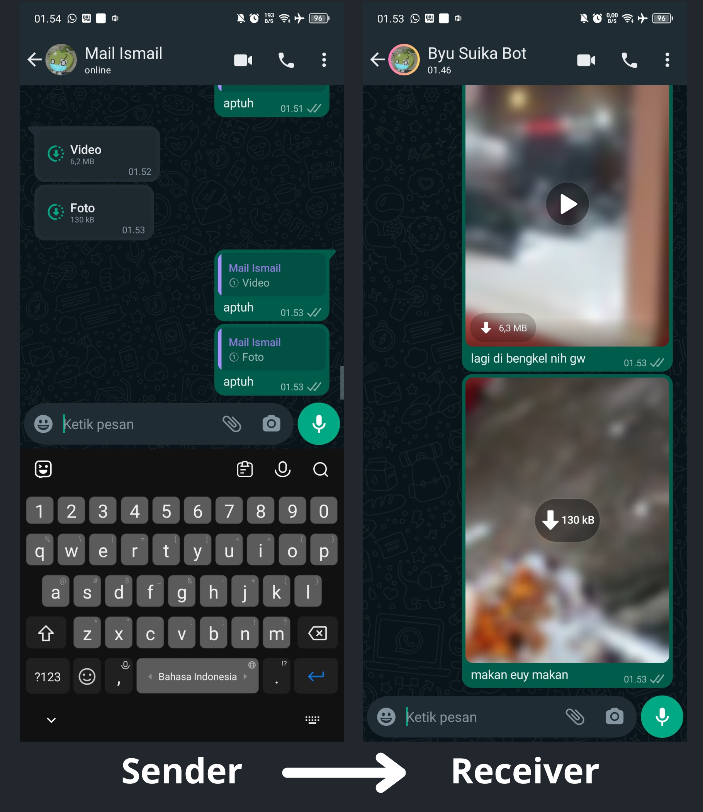

<a name="readme-top"></a>

<!-- PROJECT LOGO -->
<br />
<div align="center">
  <a href="https://github.com/hasyim404/wa-intip/blob/master/temp/suika.png">
    
  </a>

  <h3 align="center">WA-Intip</h3>

  <p align="center">
    Sebuah potongan kode dari SuikaBot Project untuk melihat</br>atau bypass pesan 1x Lihat dari pengguna lain.
    <br />
    <a href="https://github.com/othneildrew/Best-README-Template"><strong>Try our sticker bot »</strong></a>
    <br />
    <br />
    Terimakasih kepada:
    <br />
    <a href="https://github.com/xhaeffer">@xhaeffer</a>
    ·
    <a href="https://github.com/iegl3">@iegl3 </a>
  </p>
</div>

<!-- ABOUT THE PROJECT -->

## About WA-Intip

<div align="center">
    <a href="https://github.com/hasyim404/wa-intip/blob/master/temp/screenshoot.png">
    
    </a>
</div>

## How to Run

### Windows

1. Download & Install [Node.JS](https://nodejs.org/en), kalo udah install lanjut ke next step.

2. Download atau Clone repository ini:

   ```sh
   git clone https://github.com/hasyim404/wa-intip.git
   ```

3. Masuk ke folder project:

   ```sh
   cd wa-intip
   ```

4. Install NPM packages:

   ```sh
   npm install
   ```

5. Ganti **targetNum** di **Baris 5** sama **no WA ke-2 lu**:

   ```sh
   const targetNum = "628xxxxxxxx@c.us";
   ```

6. Jalanin program:

   ```sh
   npm run start
   ```

   atau:

   ```sh
   node index.js
   ```

7. Tunggu QR-Code muncul, lalu scan pake **no WA utama lu**

### Linux

- _Coming soon_

## Available Commands

- `.intip` = Reply pesan 1x lihat, trus ketik `.intip`, send.

  ```sh
  Langsung eksekusi di nomer target (percakapan saat ini).
  ```

- `aptuh` = Reply pesan 1x lihat, trus ketik `aptuh`, send.
  ```sh
  Dikirim ke nomor penerima (nomor ke-2 lu)
  ```
