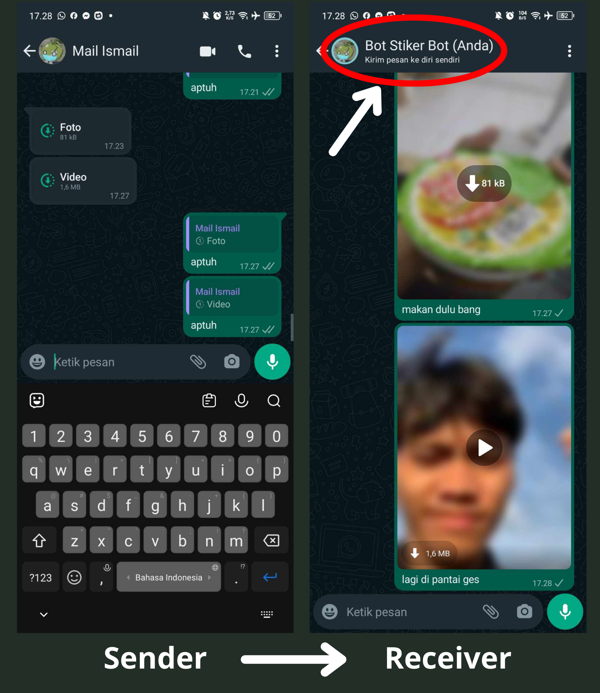
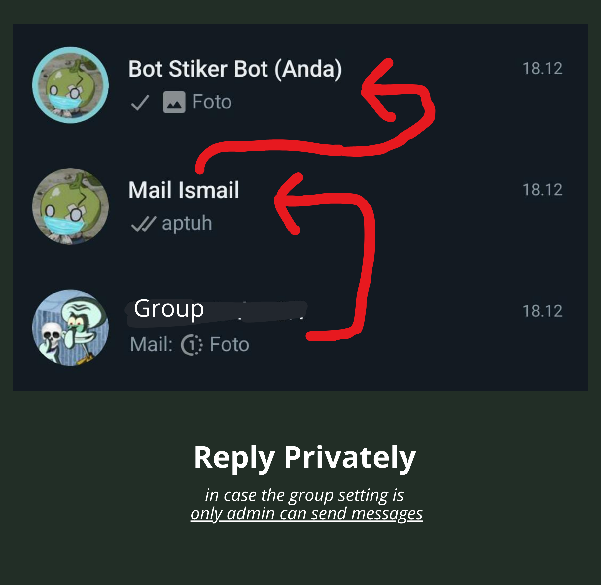

<a name="readme-top"></a>

<!-- PROJECT LOGO -->
<br />
<div align="center">
  <a href="https://github.com/hasyim404/wa-intip/blob/master/temp/suika.png">
    
  </a>

  <h3 align="center">WA-Intip</h3>

  <p align="center">
    Sebuah potongan kode dari SuikaBot Project untuk melihat atau bypass pesan 1x Lihat dari pengguna lain dan dikirim ke nomor kita sendiri.
    <br />
    <a href="https://wa.me/6285179910233"><strong>Try our sticker bot »</strong></a>
    <br />
    <br />
    Terimakasih kepada:
    <br />
    <a href="https://github.com/xhaeffer">@xhaeffer</a>
    ·
    <a href="https://github.com/iegl3">@iegl3 </a>
  </p>
</div>

<!-- ABOUT THE PROJECT -->

## About WA-Intip

### [*] Private Chat:

<div align="center">
    <a href="https://github.com/hasyim404/wa-intip/blob/master/assets/img/private-msg.png">
    
    </a>
</div>

### [*] Only Admin can send msg in Group:

<div align="center">
    <a href="https://github.com/hasyim404/wa-intip/blob/master/assets/img/only-admin-can-send-msg-group.png">
    
    </a>
</div>

## How to Run

### <ins> Windows </ins>

**Note:** RDP belum tested !! </br>

<!-- **Note:** Kalo error coba ganti path **../chrome.exe** nya lalu sesuaikan sama punya lu. -->

1. Download & Install [Node.JS](https://nodejs.org/en), kalo udah install lanjut ke next step.

2. Download atau Clone repository ini:

   ```sh
   git clone https://github.com/hasyim404/wa-intip.git
   ```

3. Masuk ke folder project:

   ```sh
   cd WA-Intip
   ```

4. Install NPM packages:

   ```sh
   npm install
   ```

5. Jalanin program:

   ```sh
   npm run start
   ```

   atau:

   ```sh
   node index.js
   ```

6. Tunggu QR-Code muncul, lalu scan pake **no WA utama lu**

7. Setelah muncul **"Client is Ready!"** maka sudah siap digunakan, enjoy.

### <ins>Linux</ins>

**Note:** VPS belum tested !! </br>

<!-- - _Coming soon_ -->

1. Install Curl

   ```sh
   sudo apt-get install curl
   ```

2. Download NodeJS (v20.x)

   ```sh
   curl -fsSL https://deb.nodesource.com/setup_20.x | sudo -E bash -
   ```

3. Install NodeJS & NPM

   ```sh
   sudo apt-get install nodejs
   ```

4. Install Chromium-Browser

   ```sh
   sudo apt-get install chromium-browser
   ```

5. Download atau Clone repository ini:

   ```sh
   git clone https://github.com/hasyim404/wa-intip.git
   ```

6. Masuk ke folder project:

   ```sh
   cd WA-Intip
   ```

7. Install NPM packages:

   ```sh
   npm install
   ```

8. Jalanin program:

   ```sh
   npm run start
   ```

   atau:

   ```sh
   node index.js
   ```

9. Tunggu QR-Code muncul, lalu scan pake **no WA utama lu**

10. Setelah muncul **"Client is Ready!"** maka sudah siap digunakan, enjoy.

## Available Commands

- `.intip` = Reply pesan 1x lihat, trus ketik `.intip`, send.

  ```sh
  Langsung eksekusi di nomer target (percakapan saat ini).
  ```

- `aptuh` = Reply pesan 1x lihat, trus ketik `aptuh`, send.
  ```sh
  Dikirim ke nomor sendiri (elu)
  ```
